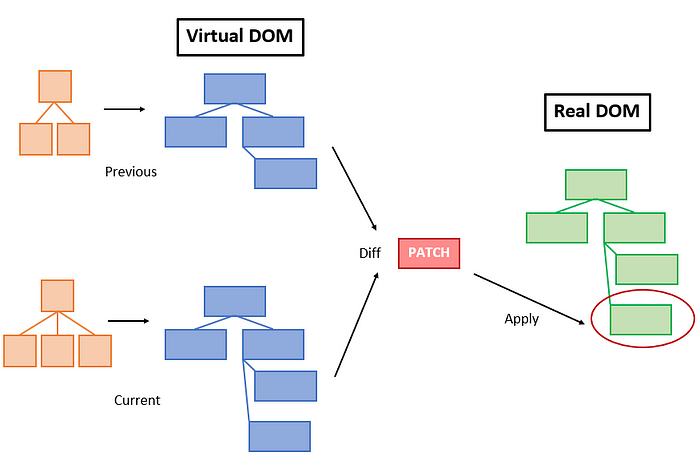
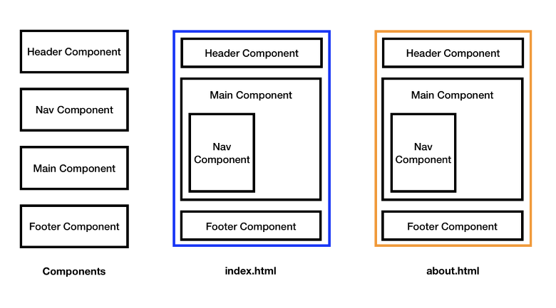
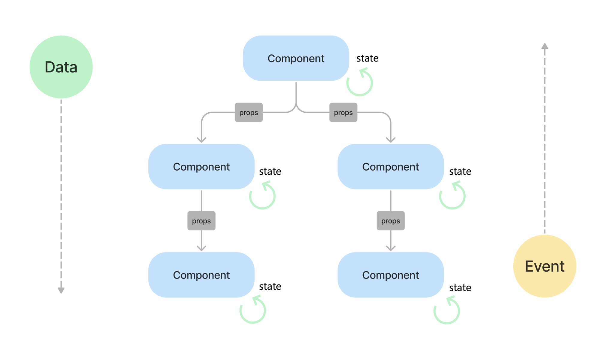
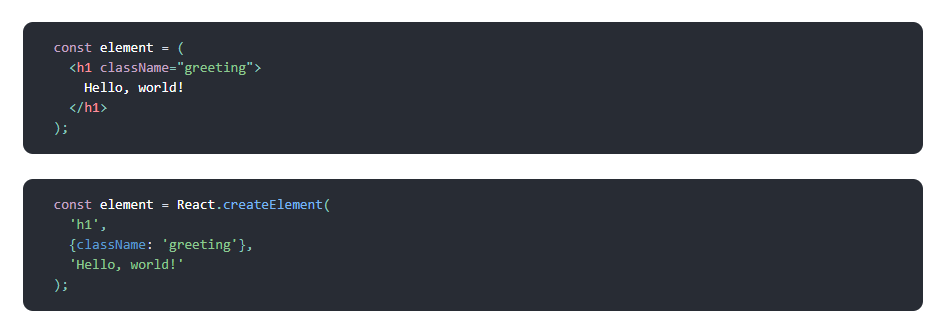

# 리액트

- 리액트는 사용자 인터페이스를 제작하는 자바스크립트 라이브러리다.
- 리액트는 사용자 인터페이스를 구축하기 위한 선언적이고 효율적이며 유연한 자바스크립트 라이브러리다.
- 리액트는 **컴포넌트**라는 작고 고립된 코드 조각을 이용하여 복잡한 UI을 구성하도록 돕는다.

## 리액트를 사용하는 이유

- 리액트는 자바스크립트 기반의 문법을 사용하기 때문에 자바스크립트에 익숙하다면 보다 쉽게 사용이 가능하다.
- 리액트는 가볍고 유연한 라이브러리로, 필요한 부분에만 적용할 수 있다.
- 리액트는 페이스북에서 개발한 오픈 소스 프로젝트로, 활발하고 다양한 커뮤니티와 생태계를 가지고 있다.

## 리액트의 특징

- Virutal DOM
  - 빠른 업데이트와 렌더링 속도 향상
  - 리액트는 브라우저가 관리하는 실제 DOM이 아닌 가상 DOM을 사용하여 UI 업데이트를 처리한다. 이를 통해 최소한의 DOM 조작이 가능하여 신속한 UI 업데이트를 가능하게 하고, 성능을 최적화시킨다.

  

- 컴포넌트 기반 구조
  - 재사용성, 개발기간 단축, 유지보수 용이
  - 리액트는 컴포넌트 기반 구조를 채택하고 있다.
  - 컴포넌트 기반 구조는 특정 기능을 수행하는 독립적인 단위인 컴포넌트를 이용해서 작은 레고 블록을 조립하듯이 컴포넌트를 조립해서 거대한 규모의 프론트 엔드 애플리케이션을 만들어 가는 구조다.
  - 애플리케이션을 구성하는 UI 요소를 컴포넌트로 분리하여 개발하고, 이러한 컴포넌트들을 조합하여 복잡한 UI를 구성할 수 있다.

  

- 단방향 데이터 흐름
  - 리액트는 데이터의 흐름을 단방향으로 유지한다. 상위 부모컴포넌트에서 하위 자식 컴포넌트로 props를 통해 전달이 되며 반대로는 전달할 수 없다.
  - 장점
    - 예측 가능한 데이터 흐름: 어떤 컴포넌트에서 데이터가 변경되었는지를 추적하기 쉽고, 버그를 찾고 수정하기가 간편해진다.
    - 컴포넌트의 독립성: 각각의 하위 컴포넌트는 상위 컴포넌트로부터 데이터를 전달받기 때문에, 각 컴포넌트는 자체적으로 독립적으로 동작할 수 있습니다. 이는 컴포넌트를 재사용하기 쉽게 만들며, 코드의 유지 보수와 테스트를 용이하게 한다
    - Virtual DOM과의 궁합: 단방향 데이터 흐름을 사용하면 React가 데이터 흐름을 추적하고 컴포넌트 간의 관계를 파악하여 변화된 부분를 빠르게 판별하여 빠른 재랜더링을 가능케 한다.
  
  

- JSX
  - 리액트는 자바스크립트와 XML을 조합한 JSX 문법을 사용한다.
  - JSX는 컴포넌트의 구조와 동작을 선언적으로 작성할 수 있게 한다.
  - JSX는 가독성을 높이고, 컴포넌트의 렌더링을 보다 직관적으로 이해할 수 있도록 돕는다. 

  

## 리액트 개발 환경 구축하기

1. Node.js와 npm 설치
   1. Node.js 공식 웹사이트(https://nodejs.org/ko)로 이동한다.
   2. 최신 LTS 버전을 다운로드하여 설치한다.
   3. CMD 창을 열고 아래 명령을 입력해서 설치된 버전을 확인한다.
        ```bash
        # Node.js 버전을 확인한다.
        node -v

        # npm 버전을 확인한다.
        npm -v
        ```
2. 코드 편집기 설치
   1. Vistual Studio Code 공식 사이트(https://code.visualstudio.com/)로 이동한다.
   2. VSCode를 다운로드하여 설치한다.
   3. 리액트 관련 확장 프로그램을 설치한다.
      - Simple React Snippets
      - Prettier - Code Formatter
3. 리액트 애플리케이션 생성
   1. CMD 창을 열고 아래어 명령어를 입력해서 리액트 프로젝트를 생성한다.
        ```bash
        # 1. Vite를 이용해서 리액트 프로젝트를 생성한다.
        npm create vite@latest my-app

        # 2. Select a framework 항목에서 React를 선택한다.
        ? Select a framework: » - Use arrow-keys. Return to submit.
            Vanilla
            Vue
        >   React
            Preact
            Lit
            Svelte
            Solid
            Qwik
            Angular
            Others

        # 3. Selecta a variant에서 JavaScript를 선택한다.
        #    이 항목에서는 프레임워크의 개발 언어를 지정한다. JavaScript와 TypeScript를 선택할 수 있다.
        #    SWC(Speedy Web Compiler)는 JavaScript/TypeScript 컴파일러다. Rust로 작성되어 기존 JavaScript 컴파일러에 비해 훨씬 빠르게 동작한다. 
        ? Select a variant: » - Use arrow-keys. Return to submit.
            TypeScript
            TypeScript + SWC
        >   JavaScript
            JavaScript + SWC
            React Router v7 ↗

        # 4. 프로젝트 생성이 완료되면 아래의 화면이 출력된다.
        Scaffolding project in E:\react-projects\my-app...

        Done. Now run:

        cd my-app     # 프로젝트 폴더로 이동해라
        npm install   # 의존성을 설치해라
        npm run dev   # 개발서버를 실행시켜라

        ```
   2. 프로젝트 생성 후 디렉토리로 이동한다.
        ```bash
        cd my-app
        ```
   3. 프로젝트 의존성을 설치한다.
        ```bash
        npm install
        ```
   4. 개발 서버를 실행시켜서 애플리케이션을 확인한다.
        ```bash
        npm run dev

        # 아래의 내용이 출력된다.
        VITE v6.0.6  ready in 446 ms

        ➜  Local:   http://localhost:5173/
        ➜  Network: use --host to expose
        ➜  press h + enter to show help
        ```
   5. 웹브라우저로 http://localhost:5173 으로 접속해서 애플리케이션을 확인한다. 


## Vite로 생성된 리액트 프로젝트 구조
```
  my-app/
  ├── node_modules/         # 설치된 패키지 (자동 생성)
  ├── public/               # 정적 파일 저장 디렉터리
  │   └── vite.svg          # 기본 로고 파일 (삭제 가능)
  ├── src/                  # 주요 소스 코드 디렉터리
  │   ├── App.css           # App 컴포넌트 스타일 파일 (삭제 가능)
  │   ├── App.jsx           # 메인 App 컴포넌트 파일
  │   ├── main.jsx          # React 진입 파일
  │   └── index.css         # 전역 스타일 파일 (삭제 가능)
  ├── .gitignore            # Git에서 제외할 파일/디렉터리 목록
  ├── index.html            # 애플리케이션의 HTML 템플릿 파일
  ├── package.json          # 프로젝트의 의존성 및 스크립트 정의
  ├── vite.config.js        # Vite 설정 파일
  └── README.md             # 프로젝트 설명 파일
```

- node_modules 폴더
  - 설치된 npm 패키지가 저장되는 디렉토리다.
  - ```npm install``` 명령어 실행 시 자동으로 생성된다.
  - 직접 수정하지 않으며, ```.gitignore```에 포함되어 버전 관리에서 제외된다.
- public 폴더
  - 애플리케이션의 정적 파일(이미지, 폰트 등)이 저장되는 디렉토리다.
  - 빌드시 그대로 복사되며, 브라우저에서 ```/``` 경로로 접근할 수 있다.
- src 폴더
  - 소스 코드 파일이 위치하는 디렉토리다.
  - 리액트 애플리케이션의 핵심 코드가 전부 여기에 저장된다.
  - 주요 파일
    - App.jsx
      - 메인 컴포넌트 파일이며, 애플리케이션의 기본 구조를 정의하는 파일이다.
      - 기본 코드
        ```javascript
        function App() {
          return (
            <div>
              <h1>리액트 애플리케이션</h1>
            </div>
          )
        }

        export default App
        ```
    - main.jsx
      - 리액트 애플리케이션의 진입점이 되는 파일이다.
      - App 컴포넌트를 ```index.html```의 DOM에 렌더링한다.
      - 기본 코드
        ```javascript
        import { createRoot } from 'react-dom/client'
        import App from './App.jsx'

        createRoot(document.getElementById('root')).render(
          <App />
        )
        ```
- index.html
  - 애플리케이션의 HTML 템플릿 파일이다.
  - 리액트 컴포넌트가 이 파일의 ```<div id="root"></div>```안에 렌더링된다.
  - 기본 코드
    ```html
    <!doctype html>
    <html lang="ko">
      <head>
        <meta charset="UTF-8" />
        <meta name="viewport" content="width=device-width, initial-scale=1.0" />
        <title>React</title>
      </head>
      <body>
        <div id="root"></div>
        <script type="module" src="/src/main.jsx"></script>
      </body>
    </html>
    ```
- package.json
  - 프로젝트 정보, 프로젝트의 의존성, 스크립트 및 설정 정보가 정의된 파일이다.
  - 주요 항목
    - ```dependencies``` : 애플리케이션에서 사용되는 라이브러리 의존성
    - ```devDependencies``` : 개발에 필요한 라이브러리 의존성
    - ```scripts``` : 스크립트
- vite.config.js
  - Vite 설정 파일이다.
- 디렉토리 구조의 확장
  - 프로젝트 규모가 커짐에 따라 src 폴더에 아래와 같은 디렉토리가 추가된다.
    ```
    src/
    ├── components/       # 재사용 가능한 컴포넌트
    ├── pages/            # 각 라우트에 대응하는 페이지
    ├── hooks/            # 커스텀 React 훅
    ├── utils/            # 유틸리티 함수
    ├── services/         # API 호출 및 데이터 처리
    └── assets/           # 이미지, 아이콘, 폰트 등
    ```