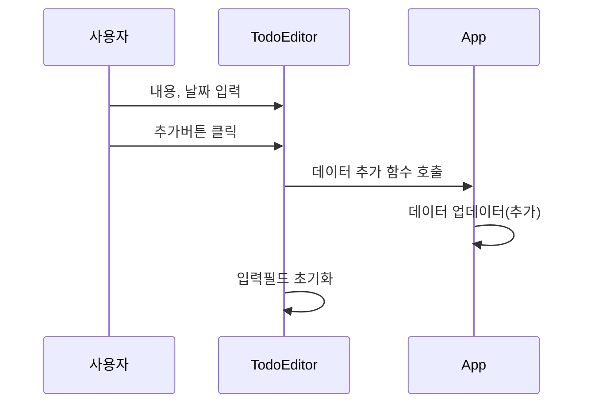

# 일정관리 애플리케이션

- 리액트로 일정 관리 애플리케이션 개발 실습 프로젝트다.

## 요구사항 분석하기

- 오늘의 날짜를 년도, 월, 일, 요일 순으로 표시한다.
- 할 일(Todo)을 작성하는 입력 폼이 있고, [추가]버튼을 클릭하면 할 일 아이템을 생성한다.
- [할 일 관리] 앱은 생성한 아이템을 페이지 하단에 리스트로 표시한다.
- 키워드 검색으로 원하는 할 일만 표시할 수 있다.
- 리스트로 표시하는 개별 할 일 아이템은 완료 여부를 표시하는 체크박스, 제목, 등록날짜, [삭제] 버튼으로 구성된다.

## 주요 컴포넌트

- Header : 요늘을 날짜를 표시 형식에 맞게 보여준다.
- TodoEditor : 새로운 할 일 아이템을 등록한다.
- TodoList : 검색어에 맞게 필터링된 할 일 리스트를 렌더링한다.
- TodoItem : 개별 할 일 아이템은 기본 정보 외에도 체크박스, [삭제] 버튼이 있다. 체크박스를 클릭하면 할 일을 마쳤는지 여부가 토클된다. [삭제] 버튼을 클릭하면 해당 아이템이 삭제된다.


### 컴포넌트별 담당 기능
- App 컴포넌트 : 할 일 데이터를 관리
- Header 컴포넌트 : 오늘 날짜 표시
- TodoEditor 컴포넌트 : 새로운 할 일 데이터 추가
- TodoList 컴포넌트 : 할 일 목록 표시(검색 기능 포함)
- TodoItem 컴포넌트 : 할 일 정보 표시(수정, 삭제 기능 포함)

## 프로젝트 개발하기

### 프로젝트 생성하기

1. 새로운 리액트 프로젝트를 생성한다.
    ```bash
    # 새 리액트 프로젝트를 생성한다.
    npm create vite@latest todo-app

    # 프로젝트 폴더로 이동한다.
    cd todo-app

    # 의존성 패키지를 설치한다.
    npm install

    # 추가 의존성 패키지를 설치한다.
    npm install -s bootstrap moment

    # 리액트 애플리케이션을 실행한다.
    npm run dev
    ```
2. 불필요한 파일과 코드를 정리한다.
   - 삭제할 폴더와 파일
     - public 폴더를 삭제한다.
     - src폴더의 assets 폴더를 삭제한다.
     - src폴더의 App.css, index.css 파일을 삭제한다.

### 새로운 할 일 추가하기



1. ```App 컴포넌트```에 할 일 데이터를 저장하는 State 생성하기
    ```javascript
    import { useState, useRef } from "react";

    function App() {
        // 할 일 정보 배열을 관리하는 State객체를 생성한다. 
        const [todos, setTodos] = useState([]);
        // 할 일 아이템의 id값으로 사용할 일련번호를 관리하는 객체를 생성한다.
        const idRef = useRef(1);

        // 이하 코드 생략
    }
    ```
2. ```App 컴포넌트```에 새로운 할 일 아이템을 추가하는 함수 정의하기
    ```javascript
    import { useState, useRef } from "react";

    function App() {
        const [todos, setTodos] = useState([]);
        const idRef = useRef(1);

        // TodoEditor 컴포넌트에서 추가 버튼을 클릭했을 때 실행될 onCreate 함수를 정의한다.
        // TodoEditor 컴포넌트에서는 {content:"내용", createdDate:날짜} 정보가 포함된 todo객체를 인자로 전달한다.
        const onCreate = (todo) => {
            // 전개 연산자를 사용해서 전달받은 todo객체의 속성을 전개하고, 
            // 추가적으로 id, done 속성이 추가된 객체를 생성한 다음
            // newItem에 대입한다.
            const newItem = {
                ...todo,
                id: idRef.current,
                done: false
            }

            // setTodos 함수(State의 Setter 함수)를 이용해서 현재 할 일 정보 배열의 값을 변경한다.
            // [새요소, ...배열]은 기존 배열의 맨 앞에 새로운 요소가 추가된 새 배열을 반환한다.
            setTodos([newItem, ...todos]);
            // idRef의 값을 1 증가시킨다.
            idRef.current = idRef.current + 1;
        }
    }
    ```
3. ```App 컴포넌트```에서 작성한 onCreate 함수를 TodoEditor 컴포넌트에 Props로 전달한다.
    ```javascript
    import "bootstrap/dist/css/bootstrap.min.css"
    import TodoEditor from "./components/TodoEditor";

    function App() {
        const [todos, setTodos] = useState([]);
        const idRef = useRef(1);

        const onCreate = (todo) => {
            const newItem = {
                ...todo,
                id: idRef.current,
                done: false
            }

            setTodos([newItem, ...todos]);
            idRef.current = idRef.current + 1;
        }

        return (
            <div className="container">
                {/* TodoEditor 컴포넌트를 포함시키고, props로 onCreate 함수를 전달한다. */}
                <TodoEditor onCreate={onCreate} />
            </div>
        )
    }
    ```
4. ```TodoEditor 컴포넌트```에 할 일과 날짜를 입력받는 입력폼을 작성한다.
    ```javascript
    import { useState, useRef } from "react";
    import moment from "moment/dist/moment.js"

    function TodoEditor({ onCreate }) {
        // 입력폼에서 입력한 새 할 일을 관리하는 State 객체를 생성한다.
        // content와 createdDate의 기본값을 미리 설정해놓는다.
        const [todo, setTodo] = useState({
            content:'',
            createdDate: moment().format("YYYY-MM-DD")
        });
        // 내용입력필드를 참조하기 위해서 Ref 객체를 생성한다.
        const contentRef = useRef();

        // 내용과 날짜 입력필드에서 onChange 이벤트가 발생할 때 실행될 이벤트 핸들러를 작성한다.
        const onFieldChange = (event) => {
            // 이벤트가 발생한 엘리먼트의 이름과 입력값을 조회한다.
            let name = event.target.name;
            let value = event.target.value;

            // 객체 전개 연산자를 이용해서 State에서 관리하는 할 일 정보를 변경한다.
            setTodo({...todo, [name]:value});
        }
        // 추가 버튼에서 onClick 이벤트가 발생할 때 실행될 이벤트 핸들러를 작성한다.
        const onBtnClick = () => {
            // 내용정보가 없으면 오류 메세지를 출력한다.
            if (!todo.content) {
                alert("내용을 입력하세요");
                contentRef.current.focus();
                return;
            }
            // props로 전달받은 onCreate 함수를 호출해서 새로운 할 일을 추가시킨다.
            onCreate(todo);
            // 이 컴포넌트가 관리하는 신규 할 일 정보를 초기화한다.
            setTodo({content:'', createdDate: moment().format("YYYY-MM-DD")});
        }
        return (
            <>
                <div className="row">
                    <div className="col-12">
                        <h3>새 일정 등록</h3>
                    </div>
                </div>
                <div className="row mb-3">
                    <div className="col-12">
                        <form className="border bg-light p-3">
                            <div className="form-group mb-3">
                                <label className="form-label">내용</label>
                                {/*
                                    - ref={contentRef}는 contentRef로 DOM 조작없이 이 엘리먼트를 참조하게 한다.
                                    - value={todo.content}는 State가 관리하는 content 값이 입력필드에 표기되게 한다.
                                    - onChange={onFieldChange}는 onChange 이벤트가 발생할 때 실행될 
                                      이벤트 핸들러 함수로 onFieldChange 함수를 등록한다.
                                */}
                                <textarea className="form-control" 
                                    rows="3" name="content" 
                                    ref={contentRef} 
                                    value={todo.content} 
                                    onChange={onFieldChange}></textarea>
                            </div>
                            <div className="form-group mb-3">
                                <label className="form-label">날짜</label>
                                {/*
                                    - value={todo.createdDate}는 State가 관리하는 createdDate 값이 입력필드에 표시되게 한다.
                                    - onChange={onFieldChange}는 onChange 이벤트가 발생할 때 실행될 
                                      이벤트 핸들러 함수로 onFieldChange 함수를 등록한다.
                                */}
                                <input className="form-control" 
                                    type="date" 
                                    name="createdDate" 
                                    value={todo.createdDate} 
                                    onChange={onFieldChange} />
                            </div>
                            <div className="text-end">
                                {/*
                                    - onClick={onBtnClick}는 onClick 이벤트가 발생할 때 실행될 
                                      이벤트 핸들러 함수로 onBtnClick 함수를 등록한다.
                                */}
                                <button type="button" 
                                    className="btn btn-primary btn-sm" 
                                    onClick={onBtnClick}>등록</button>
                            </div>
                        </form>
                    </div>
                </div>
            </>
        )
    }
    ```
### 할 일 목록 표시하기
1. ```App 컴포넌트```에 ```TodoList컴포넌트```를 포함시키고, Props로 할일 목록을 전달한다.
    ```javascript
    import "bootstrap/dist/css/bootstrap.min.css"
    import TodoEditor from "./components/TodoEditor";
    import TodoList from "./components/TodoList;

    function App() {
        const [todos, setTodos] = useState([]);
        const idRef = useRef(1);

        const onCreate = (todo) => {
            const newItem = {
                ...todo,
                id: idRef.current,
                done: false
            }

            setTodos([newItem, ...todos]);
            idRef.current = idRef.current + 1;
        }

        return (
            <div className="container">
                <TodoEditor onCreate={onCreate} />
                {/*
                    - <TodoList> 컴포넌트를 추가한다.
                    - Props로 todos배열을 전달한다.
                */}
                <TodoList todos={todos}>
            </div>
        )
    }
    ```
2. 할 일 목록을 표시한 ```TodoList```컴포넌트를 작성한다.
    ```javascript
    import TodoItem from "./TodoItem";

    // 부모컴포넌트에서 <TodoList todos={todos} />로 전달한 할 일 목록을 전달받는다.
    function TodoList({ todos }) {
        return (
            <>
                <div className="row">
                    <div className="col-12">
                        <h4>일정 목록</h4>
                    </div>
                </div>
                
                <div className="row mb-3">
                    <div className="col-12">
                        {/*
                            - todos 배열의 map() 메소드를 이용해서 <TodoItem /> 컴포넌트를 반복해서 렌더링한다.
                            - {...todo}는 todo객체의 속성을 전개연산자로 전개해서 TodoItem 컴포넌트에 Props로 전달한다.
                            - key={todo.id}는 반복해서 생성되는 <TodoItem />를 고유하게 식별하기 위해 key값을 설정한다.
                        */}
                        {todos.map((todo) => 
                            (
                                <TodoItem {...todo} 
                                    key={todo.id} />
                            )
                        )}
                    </div>
                </div>
            </>
        )
    };
    ```
3. 개별 할 일 정보를 표시하는 ```TodoItem```컴포넌트를 작성한다.
    ```javascript
    import moment from "moment/dist/moment.js"

    // 부모 컴포넌트에서 <TodoItem {...todo} />를 todo객체의 속성을 전개해서 전달한 값을 객체 비구조화할당으로 전달받는다.
    function TodoItem({ id, content, done, createdDate }) {
        
        return (
            <div className="row mb-3">
                <div className="col-12">
                    <div className="border p-3">
                        <div className="row">
                            <div className="col-1">
                                {/* 일정 완료여부를 체크박스로 표시한다. */}
                                <input type="checkbox" 
                                    checked={done} />
                            </div>
                            <div className="col-7">
                                {/* 일정 내용을 표시한다. */}
                                {content}
                            </div>
                            <div className="col-2 text-end">
                                {/* 일정 날짜를 표시한다. */}
                                {moment(createdDate).format("YYYY-MM-DD")}
                            </div>
                            <div className="col-2 text-end">
                                <button className="btn btn-danger btn-sm">삭제</button>
                            </div>
                        </div>
                    </div>
                </div>
            </div>
        );
    }
    ```