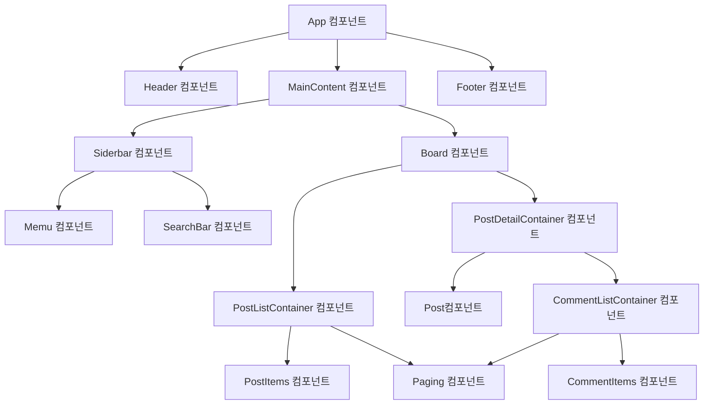

# 컴포넌트

- **컴포넌트**는 사용자 인터페이스(UI)를 구성하는 독립적이고 재사용 가능한 코드 조각이다.
- **리액트 애플리케이션**은 **여러 개의 컴포넌트를 계층적으로 조합**하여 하나의 완성된 UI를 만든다.
- 컴포넌트는 애플리케이션의 독립적인 부분을 캡슐화하며, 이를 통해 코드의 재사용성과 유지보수성을 높인다.

## 컴포넌트 구조 기반 개발

### 컴포넌트 구조 기반으로 애플리케이션을 개발하는 이유

- **독립성** : 컴포넌트는 독립적으로 동작하며, 자신만의 UI(화면), 데이터, 로직(사용자와 상호작용)을 관리한다.
- **재사용성** : 하나의 컴포넌트를 다양한 컨텍스트에서 재사용하여 중복 코드를 줄일 수 있다.

### 컴포넌트의 역할

- UI 정의 : 컴포넌트는 화면에 렌더링할 UI의 구조를 정의한다.
- 데이터 표현 : 컴포넌트는 데이터(state, props)를 사용하여 UI를 동적으로 업데이트한다.
- 이벤트 처리 : 컴포넌트는 사용자와 상호작용으로 발생하는 이벤트를 처리하고, 애플리케이션의 동작을 정의한다. 

### 컴포넌트의 장점

- 유지보수성 : UI의 특정 부분을 독립적으로 변경할 수 있다.
- 가독성 : 코드가 작은 단위로 나뉘어 있어 가독성이 향상된다.
- 테스트 용이성 : 컴포넌트를 독립적으로 테스트 할 수 있다.
- 생산성 : 재사용 가능한 컴포넌트를 통해 개발 속도가 향상된다.

## 컴포넌트의 계층 구조

- 게시판 애플리케이션을 리액트로 개발할 때 필요한 컴포넌트와 컴포넌트 간의 계층구조를 살펴보자.

### 게시판 애플리케이션의 컴포넌트 계층 구조

### 게시판 애플리케이션의 컴포넌트

- **App 컴포넌트** : 최상위 루트 컴포넌트다. 애플리케이션의 주요 섹션(Header, MainContent, Footer)를 포함한다.
- **Header, Footer 컴포넌트** : Header는 상단 네비게이션과 로고를 포함하고, Footer는 하단 정보를 포함한다.
- **MainContent 컴포넌트** : 메인 컨텐츠를 관리하는 컴포넌트다. Siderbar와 Board를 포함한다.
- **Siderbar 컴포넌트** : 검색(SearchBar)과 메뉴(Menu)를 포함하는 컴포넌트다.
- **Board 컴포넌트** : 게시판과 관련된 주요 뷰를 관리하며, 게시판리스트(PostListContainer)와 게시판상세(PostDetailContainer) 컴포넌트를 포함한다.
- **PostListContainer 컴포넌트** : 게시판 목록 화면을 관리하는 컴포넌트다. 게시글들(PostItems)과 페이징(Paging)을 포함한다.
- **PostDetailContainer 컴포넌트** : 게시글 상세 화면을 관리하는 컴포넌트다. 게시글상세(Post)와 댓글리스트(ComentListContainer)를 포함한다. 
- **CommentListContaier 컴포넌트** : 댓글 목록 화면을 관리하는 컴포넌트다. 댓글들(CommentItems)과 페이징(Paging) 컴포넌트를 포함한다.
- **Paging 컴포넌트** : 페이징 기능을 제공하는 컴포넌트다. 

### 