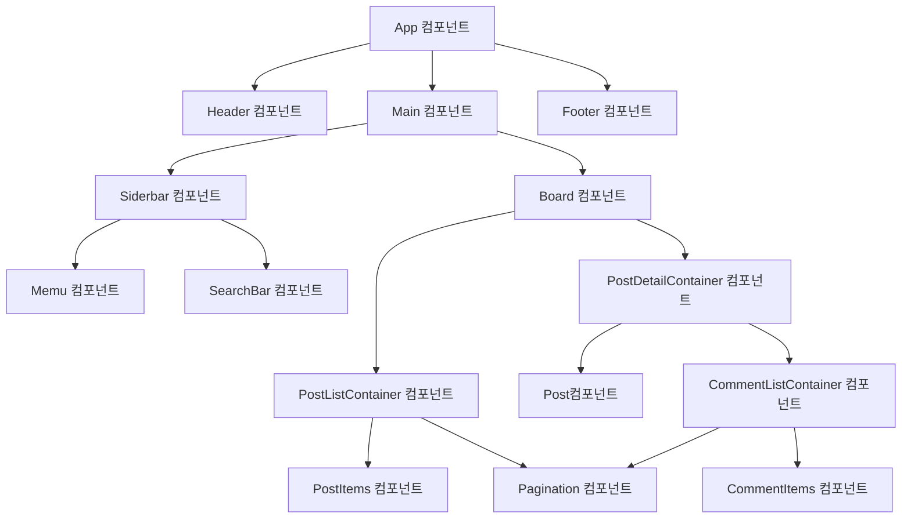

# 컴포넌트

- **컴포넌트**는 사용자 인터페이스(UI)를 구성하는 독립적이고 재사용 가능한 코드 조각이다.
- **리액트 애플리케이션**은 **여러 개의 컴포넌트를 계층적으로 조합**하여 하나의 완성된 UI를 만든다.

## 게시판 애플리케이션의 컴포넌트 계층 구조

```mermaid
graph TD
    App[App 컴포넌트] --> Header[Header 컴포넌트]
    App --> MainContent[Main 컴포넌트]
    App --> Footer[Footer 컴포넌트]
    MainContent --> Sidebar[Siderbar 컴포넌트]
    MainContent --> Board[Board 컴포넌트]
    Sidebar --> Menu[Memu 컴포넌트]
    Sidebar --> SearchBar[SearchBar 컴포넌트]
    Board --> PostListContainer[PostListContainer 컴포넌트]
    PostListContainer --> PostItems[PostItems 컴포넌트]
    PostListContainer --> Pagination[Pagination 컴포넌트]
    Board --> PostDetailContainer[PostDetailContainer 컴포넌트]
    PostDetailContainer --> Post[Post컴포넌트]
    PostDetailContainer --> CommentListContainer[CommentListContainer 컴포넌트]
    CommentListContainer --> CommentItems[CommentItems 컴포넌트]
    CommentListContainer --> Pagination[Pagination 컴포넌트]
```