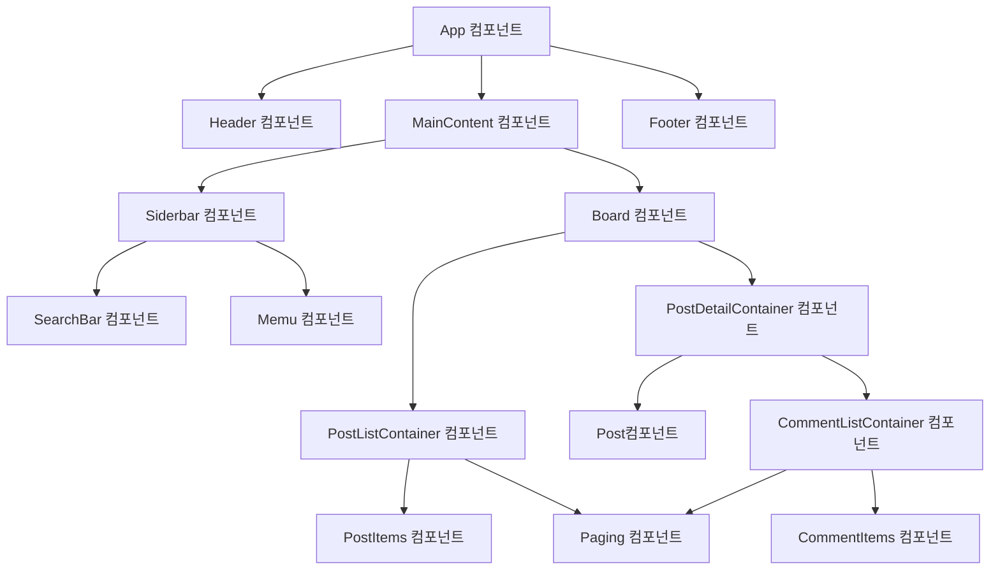
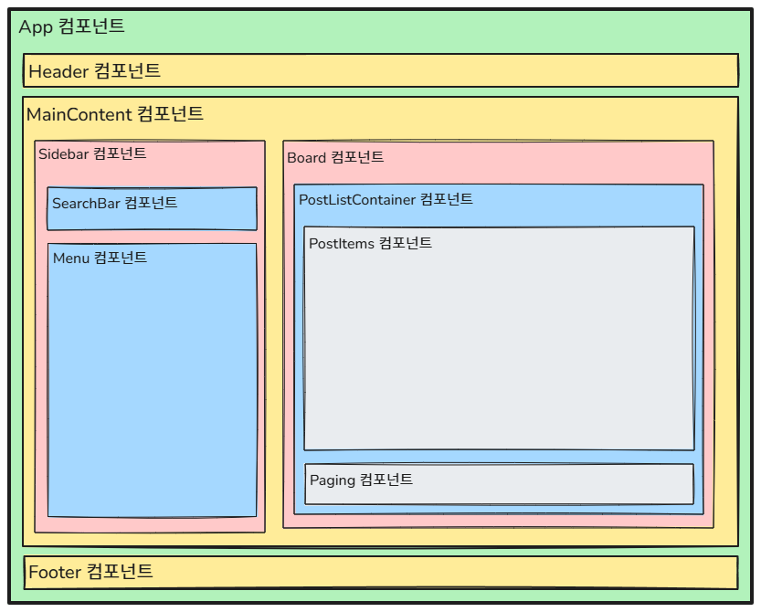
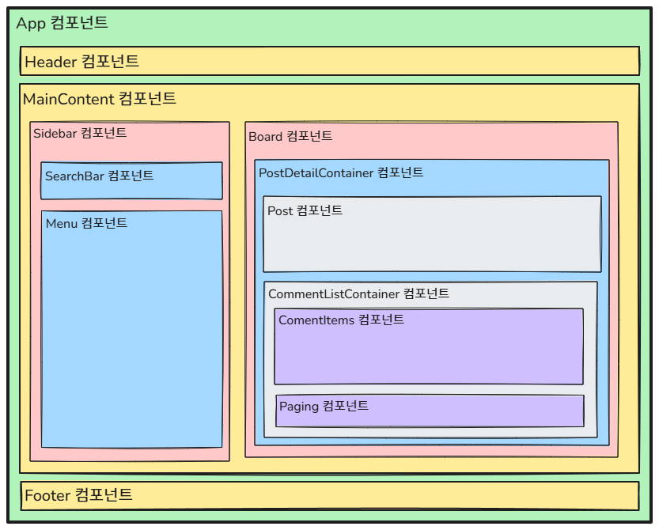
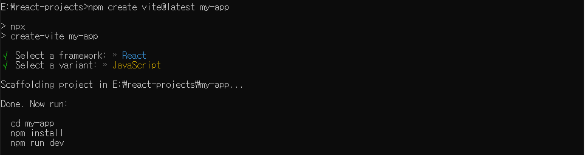
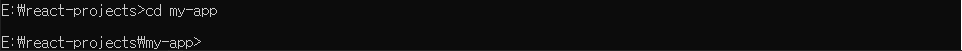
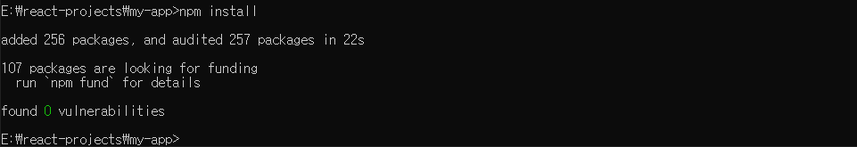
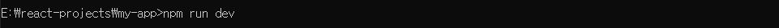
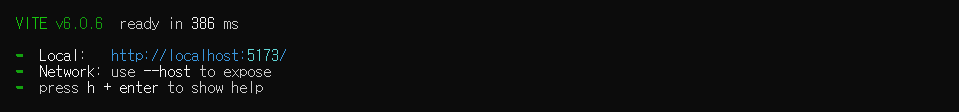
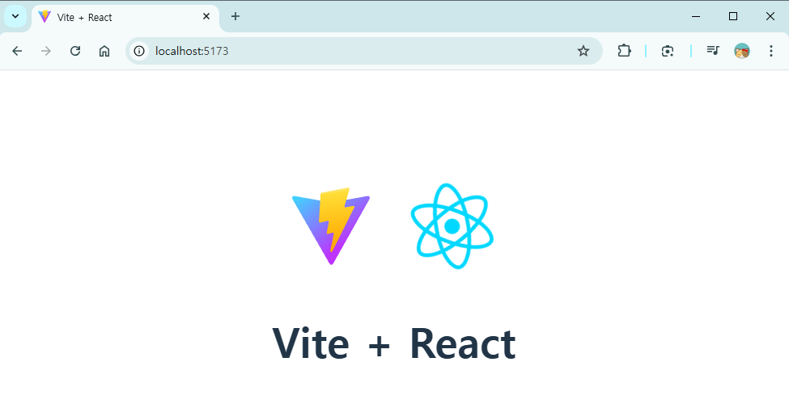
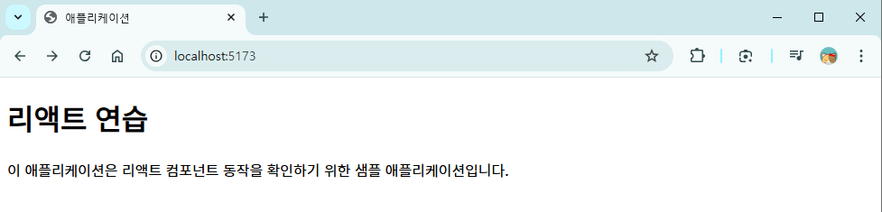

# 컴포넌트

- **컴포넌트**는 사용자 인터페이스(UI)를 구성하는 독립적이고 재사용 가능한 코드 조각이다.
- **리액트 애플리케이션**은 **여러 개의 컴포넌트를 계층적으로 조합**하여 하나의 완성된 UI를 만든다.
- 컴포넌트는 애플리케이션의 독립적인 부분을 캡슐화하며, 이를 통해 코드의 재사용성과 유지보수성을 높인다.

## 컴포넌트 구조 기반 개발

### 컴포넌트 구조 기반으로 애플리케이션을 개발하는 이유

- **독립성** : 컴포넌트는 독립적으로 동작하며, 자신만의 UI(화면), 데이터, 로직(사용자와 상호작용)을 관리한다.
- **재사용성** : 하나의 컴포넌트를 다양한 컨텍스트에서 재사용하여 중복 코드를 줄일 수 있다.

### 컴포넌트의 역할

- UI 정의 : 컴포넌트는 화면에 렌더링할 UI의 구조를 정의한다.
- 데이터 표현 : 컴포넌트는 데이터(state, props)를 사용하여 UI를 동적으로 업데이트한다.
- 이벤트 처리 : 컴포넌트는 사용자와 상호작용으로 발생하는 이벤트를 처리하고, 애플리케이션의 동작을 정의한다. 

### 컴포넌트의 장점

- 유지보수성 : UI의 특정 부분을 독립적으로 변경할 수 있다.
- 가독성 : 코드가 작은 단위로 나뉘어 있어 가독성이 향상된다.
- 테스트 용이성 : 컴포넌트를 독립적으로 테스트 할 수 있다.
- 생산성 : 재사용 가능한 컴포넌트를 통해 개발 속도가 향상된다.

## 컴포넌트의 계층 구조 예시

- 게시판 애플리케이션을 리액트로 개발할 때 필요한 컴포넌트와 컴포넌트 간의 계층구조를 살펴보자.

### 게시판 애플리케이션의 컴포넌트 계층 구조


### 게시판 애플리케이션의 UI 구성

#### 게시글 목록 화면의 컴포넌트 구성


#### 게시글 상세 화면의 컴포넌트 구성


### 게시판 애플리케이션의 컴포넌트

- **App 컴포넌트** : 최상위 루트 컴포넌트다. 애플리케이션의 주요 섹션(Header, MainContent, Footer)를 포함한다.
- **Header, Footer 컴포넌트** : Header는 상단 네비게이션과 로고를 포함하고, Footer는 하단 정보를 포함한다.
- **MainContent 컴포넌트** : 메인 컨텐츠를 관리하는 컴포넌트다. Siderbar와 Board를 포함한다.
- **Siderbar 컴포넌트** : 검색(SearchBar)과 메뉴(Menu)를 포함하는 컴포넌트다.
- **Board 컴포넌트** : 게시판과 관련된 주요 뷰를 관리하며, 게시판리스트(PostListContainer)와 게시판상세(PostDetailContainer) 컴포넌트를 포함한다.
- **PostListContainer 컴포넌트** : 게시판 목록 화면을 관리하는 컴포넌트다. 게시글들(PostItems)과 페이징(Paging)을 포함한다.
- **PostDetailContainer 컴포넌트** : 게시글 상세 화면을 관리하는 컴포넌트다. 게시글상세(Post)와 댓글리스트(ComentListContainer)를 포함한다. 
- **CommentListContaier 컴포넌트** : 댓글 목록 화면을 관리하는 컴포넌트다. 댓글들(CommentItems)과 페이징(Paging) 컴포넌트를 포함한다.
- **Paging 컴포넌트** : 페이징 기능을 제공하는 컴포넌트다. 

## 리액트 프로젝트 생성

### 새 리액트 프로젝트 생성하기

1. 새로운 리액트 프로젝트를 생성한다.
    
2. 리액트 프로젝트 폴더로 이동한다.
    
3. 프로젝트 의존성을 설치한다.
    
4. 리액트 애플리케이션을 실행한다.
    
    
5. 웹 브라우저에서 http://localhost/5173/ 으로 접속해서 확인한다.
    

### 리액트 프로젝트에서 불필요한 파일 및 코드 정리하기

1. public 폴더의 불필요한 정적 컨텐츠 파일을 삭제한다.
   - vite.svg(웹 브라우저 탭에 표시되는 아이코 파일) 파일을 삭제한다.
2. src 폴더의 불필요한 폴더와 파일을 삭제한다.
   - assets 폴더에서 react.svg(vite 로고 파일) 파일을 삭제한다.
   - src 폴더의 App.css, index.css(템플릿 페이지의 CSS 파일) 파일을 삭제한다.
3. main.jsx 파일에서 불필요한 코드를 삭제한다.
    ```javascript
    import { createRoot } from 'react-dom/client'
    import App from './App.jsx'

    createRoot(document.getElementById('root')).render(
        <App />
    )
    ```
4. App.jsx 파일에서 불필요한 코드를 삭제한다.
    ```javascript
    function App() {
        return (
            <div>
                <h1>리액트 연습</h1>
                <p>이 애플리케이션은 리액트 컴포넌트 동작을 확인하기 위한 샘플 애플리케이션입니다.</p>
            </div>
        )
    }

    export default App
    ```    
5. index.html 파일에서 불필요한 코드를 삭제한다.
    ```javascript
    <!doctype html>
    <html lang="ko"> <!-- lang="en"을 lang="ko"로 변경한다. -->
    <head>
        <meta charset="UTF-8" />
        <meta name="viewport" content="width=device-width, initial-scale=1.0" />
        <title>애플리케이션</title>
    </head>
    <body>
        <div id="root"></div>
        <script type="module" src="/src/main.jsx"></script>
    </body>
    </html>
    ```
6. 위와 같이 수정하면 웹 브라우저에는 아래와 같이 표시된다.
    

## 리액트 애플리케이션에서 index.html이 표시되는 원리

### index.html

- 리액트 애플리케이션에서 ```index.html```은 최소한의 HTML 구조만 포함한다.
- 주된 역할은 리액트 컴포넌트를 삽입할 지점을 제공하는 것이다.
- 리액트 컴포넌트는 일반적으로 ```<div id="root"></div>```로 컴포넌트가 삽일될 지점을 표시한다.
- index.html의 코드 내용
    ```html
    ```javascript
    <!doctype html>
    <html lang="ko">
    <head>
        <meta charset="UTF-8" />
        <meta name="viewport" content="width=device-width, initial-scale=1.0" />
        <title>애플리케이션</title>
    </head>
    <body>
        <div id="root"></div>  <!-- 리액트 컴포넌트가 삽입될 위치다. -->
        <script type="module" src="/src/main.jsx"></script>
    </body>
    </html>
    ```
### src/main.jsx

- 리액트 애플리케이션의 진입점이 되는 파일이다.
- ```src/main.jsx```에서는 React DOM 라이브러리를 사용하여 ```index.html```의 ```<div id="root"></div>```에 리액트 컴포넌트를 렌더링한다.
- main.jsx의 코드 내용
    ```javascript
    // react-dom/client 모듈에서 createRoot 함수를 가져온다.
    // createRoot 함수는 react 18에서 도입된 새로운 렌더링 API다.
    // 기존의 ReactDOM.render 함수를 대체한다.
    import { createRoot } from 'react-dom/client'
    // App는 애플리케이션의 최상위 컴포넌트 이름이다.
    // src/App.jsx에 정의된 최상위 컴포넌트를 가져온다.
    import App from './App.jsx'

    // document.getElementById('root')
    //     + index.html 파일에 있는 <div id="root"></div> 엘리먼트를 선택한다.
    //     + 이 div 엘리먼트는 리액트 애플리케이션이 렌더링되는 지점이다.
    // createRoot()
    //     + createRoot 함수는 선택된 DOM 요소를 리액트 애플리케이션의 루트 컨테이너로 설정한다.
    //     + 리액트는 이 컨테이너를 통해 DOM을 조작하고 업데이트한다.
    // createRoot().render(<App />)
    //     + render() 메소드는 지정된 리액트 컴포넌트를 DOM에 렌더링한다.
    //     + 이 애플리케이션에서는 <App /> 컴포넌트를 렌더링하므로, App 컴포넌트 내부의 JSX가 화면에 표시된다. 
    createRoot(document.getElementById('root')).render(
        <App />
    )
    ```

### src/App.jsx

- 리액트 애플리케이션의 최상위 컴포넌트 파일이다.
- App.jsx의 코드 내용
    ```javascript
    // function App() {}
    //     + App는 리액트 컴포넌트의 이름이다.
    //     + 함수형 리액트 컴포넌트로 작성되어 있으며, 컴포넌트 이름은 대문자로 시작해야 리액트에서 컴포넌트로 인식한다.
    function App() {
        // return 은 JSX를 반환한다.
        //      + 이 JSX는 컴포넌트가 브라우저에 렌더링할 내용을 정의한다.
        //      + JSX는 JavaScript 코드 내에 HTML과 유사한 문법을 사용하여 UI를 선언적인 방법으로 표현하는 방법이다.
        return (
            <div>
                <h1>리액트 연습</h1>
                <p>이 애플리케이션은 리액트 컴포넌트 동작을 확인하기 위한 샘플 애플리케이션입니다.</p>
            </div>
        )
    }
    ```

### 전체 코드의 동작 과정

1. 브라우저가 ```index.html```을 로드한다.
    - 이 파일에는 ```<div id="root"></div>```라는 빈 컨테이너가 포함되어 있다.
    - 이 파일에는 ```<script type="module" src="/src/main.jsx"></script>```로 리액트 애플리케이션의 진입점이 되는 파일이 포함되어 있다.
2. ```src/main.jsx```에서 ```document.getElementById('root')```로 리액트 컴포넌트가 삽입될 엘리먼트를 선택한다.
3. ```src/main.jsx```에서 ```createRoot()```함수를 실행해서 React DOM을 초기화하고, 선택된 ```<div id="root"></div>```엘리먼트를 리액트 애플리케이션의 루트 컨테이너로 설정한다.
4. ```src/main/jsx```에서 ```createRoot().render(<App />)```를 호출하여 ```App 컴포넌트```를 렌더링한다.
    - ```App 컴포넌트```가 반환하는 JSX가 ```<div id="root"></div>```안에 삽입된다.
5. 웹 브라우저는 ```App 컴포넌트```가 렌더링된 내용이 화면에 표시된다.
