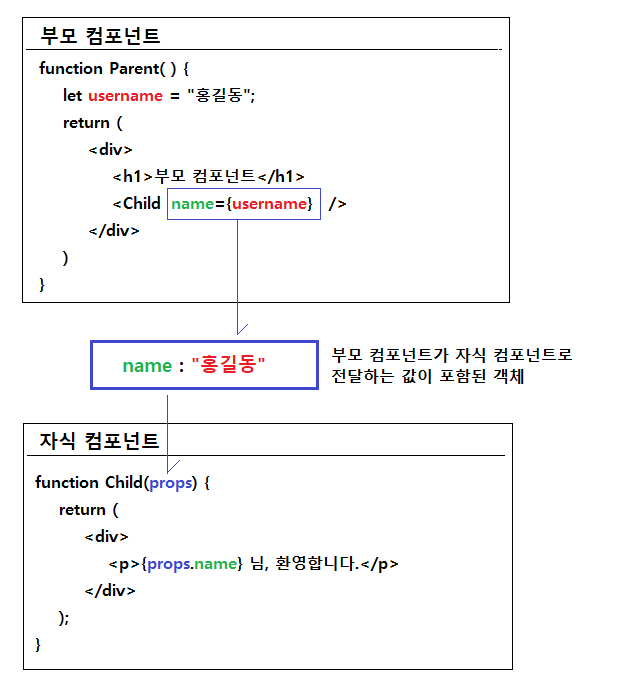

# 리액트 애플리케이션에서 데이터 전달과 관리

- 리액트 애플리케이션에서 데이터 전달과 관리는 **컴포넌트 기반 구조**의 핵심이다.
- 리액트는 단방향 데이터 흐름을 따른다.
- 리액트는 부모 컴포넌트에서 자식 컴포넌트로 데이터를 전달할 수 있다.
- 리액트는 여러 컴포넌트 간 데이트를  공유하면 관리할 수 있다.

## props를 통한 데이터 전달

- **props**는 **부모 컴포넌트**에서 **자식 컴포넌트**로 데이터를 전달할 때 사용한다.
- 자식 컴포넌트는 전달받은 **props**를 **읽기 전용**으로 사용한다.

### props를 이용해서 부모 컴포넌트에서 자식 컴포넌트로 데이터 전달하기

- **props**는 properties의 줄인 표현으로 컴포넌트의 속성을 설정할 때 사용하는 문법 요소다.
- **props**는 자식 컴포넌트를 불러와 사용하는 부모 컴포넌트에서 설정한다.

#### 부모 컴포넌트

```javascript
// 사용할 자식 컴포넌트를 포함시킨다.
import Child from "./Child.jsx";

// Parent() 함수는 부모 컴포넌트를 정의하는 함수다.
//      + <Child />는 부모 컴포넌트에서 자식 컴포넌트를 사용하는 코드다.
//      + <Child name={username} />은 부모 컴포넌트에서 name이라는 props를 설정한다.
//      + <Child name={username} />은 자식 컴포넌트에 name이라는 props를 전달하도록 설정한다. 
function Parent() {
    let username = "홍길동";

    return (
        <div>
            <h1>부모 컴포넌트</h1>
            <Child name={username} />
        </div>
    );
}

export default Parent;
```

#### 자식 컴포넌트

```javascript
// Child() 함수는 자식 컴포넌트를 정의하는 함수다.
//      + 부모 컴포넌트가 자식 컴포넌트로 전달한 값을 전달받기 위해서는 자식 컴포넌트를 정의하는 함수에 매개변수로 props를 정의한다.
//      + props에는 부모 컴포넌트가 자식 컴포넌트로 전달한 값이 포함되어 있다.
//      + 이 애플리케이션에서는 부모 컴포넌트가 name이라는 이름으로 username 변수에 저장된 값("홍길동")을 전달하였다.
function Child(props) {
    return (
        <div>
            <p>{props.name}님, 반갑습니다.</p>
        </div>
    ) 
}

export default Child;
```

### Parent 컴포넌트에서 Child 컴포넌트로 값의 전달




