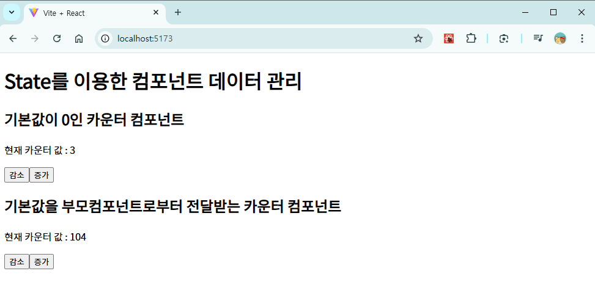

# 컴포넌트에서 데이터 관리

## 리액트 State

- 리액트는 **State**객체를 이용해서 컴포넌트의 동적인 데이터나 상태를 관리한다.
- **State**객체는 특정 시점의 데이터를 나타내며, 리액트 컴포넌트는 이 **State**를 기반으로 화면을 렌더링한다.
- **State**객체에 저장된 데이터의 변경이 발생하면 리액트가 이를 감지하고 컴포넌트를 다시 렌더일하여 화면을 업데이트한다.
- **State**는 컴포넌트 내부에서 선언 및 관리되며, 컴포넌트 외부에서는 직접 접근하거나 수정할 수 없다.

### State와 Props의 주요 차이점

| 특성 | State | Props |
|---|---|---|
| 데이터 소유 | 컴포넌트 내부에서 관리한다. | 부모 컴포넌트에서 전달한다. |
| 변경 가능성 | 변경가능하다. | 읽기 전용이다. |
| 목적 | 컴포넌트의 동적인 데이터를 관리한다. | 부모 컴포넌트로부터 전달받은 데이터를 자식 컴포넌트에서 사용한다. |
| 수정 방법 | ```usetState```의 ```setter함수```를 사용한다. | 직접 수정 불가능하다. 부모 컴포넌트에서만 변경가능하다. |
| 초기값 설정 | 컴포넌트 내부에서 초기값을 설정한다. | 부모 컴포넌트로부터 값을 전달받는다. |

## 리액트 State의 선언

- State 선언 방식은 컴포넌트의 유형에 따라 다르다.
- 함수형 컴포넌트에서느 ```useState```훅(hook)을 사용하고, 클래스형 컴포넌트에서는 ```this.state```를 사용한다.
    
    > ### 리액트의 **훅(Hooks)**
    > #### 리액트 훅(Hooks)이란?
    > * 리액트의 **훅(Hooks)**은 함수형 컴포넌트에서 **상태 관리**와 **라이프 사이클 기능을 구현**할 수 있도록 제공되는 함수들이다.
    > * 리액트 버전 16.8에서 처음 도입되었다.
    > * 클래스형 컴포넌트의 대안으로 등장하여 코드의 간결성, 가독성, 재사용성을 높인다.
    > #### 주요 훅
    > * useState : 컴포넌트 상태 관리
    > * useEffect : 부수 효과 관리(데이터 가져오기, 이벤트 등록 등)
    > * useContext : 전역 상태 관리 및 Context 데이터 관리
    > * userReducer : 복잡한 상태 관리
    > * useMemo : 계산 최적화
    > * useCallback : 함수 최적화 및 불필요한 렌더링 방지
    > * useRef : DOM 요소 참조 및 비동기 변수 관리

### 함수형 컴포넌트에서 State 선언

- 함수형 컴포넌트에서는 리액트의 훅 중 하나인 ```useState```를 사용하여 State를 선언한다.
- 기본 구조
    ```javascript
    const [변수명, setter함수명] = userState(초기값);
    
    // 변수명 : 현재 상태값을 저장하는 변수다.
    // setter함수명 : 상태를 업데이트하기 위한 함수다. 이 함수는 상태를 변경하고, 변경된 상태에 따라 컴포넌트를 다시 렌더링한다.
    // 초기값 : 상태의 초기값이다. 숫자, 문자열, 객체, 배열 등 다양한 유형의 초기값을 설정할 수 있다.
    ```
- useState() 훅의 동작 설명
    ```javascript
    // State 선언
    const [count, setCount] = useState(0);

    // 1. useState(0)
    //      초기 상태값을 설정한다.
    //      리액트 내부에서 현재 값을 저장하는 변수와 setter함수(값을 변경하는 함수)를 생성한다.
    //      변수와 setter함수를 배열에 담아서 반환한다.
    // 2. count
    //      현재 상태값을 저장하는 변수다.
    //      count 변수에 대입된 값을 읽기 전용이며, 직접 수정할 수 없다.
    // 3. setCount
    //      현재 상태값을 변경하는 함수가 대입되는 변수다.
    //      setCount함수를 호출하면 리액트가 State에서 현재 상태값을 변경하고 검포넌트를 다시 렌더링한다.
    ```
- useState() 훅의 도식화
    

## 리액트 State 활용 예시

- 리액트를 사용하여 버튼을 클릭할 때 마다 카운터 값이 증가되거나 감소되고, 현재 카운터 값을 표시하는 애플리케이션을 작성한다.

### 카운터 리액트 애플리케이션 만들기

1. 새로운 리액트 프로젝트를 생성한다.
    ```bash
    # 새 리액트 프로젝트를 생성한다.
    npm create vite@latest counter-app

    # 프로젝트 폴더로 이동한다.
    cd counter-app

    # 의존성 패키지를 설치한다.
    npm install

    # 리액트 애플리케이션을 실행한다.
    npm run dev
    ```
2. 불필요한 파일과 코드를 정리한다.
3. Counter1 컴포넌트, Counter2 컴포넌트를 정의한다.
    - Counter1 컴포넌트와 Counter2 컴포넌트에 중복코드가 많은 것은 본 예제에서는 무시한다.
  
    ```javascript
    // Counter1.jsx
    import { useState } from "react";

    function Counter1() {
        const [count, setCount] = useState(0);

        const incrementCount = function() {
            setCount(count + 1);
        }
        const decrementCount = () => setCount(count - 1);

        return (
            <div>
                <h2>기본값이 0인 카운터 컴포넌트</h2>
                <p>현재 카운터 값 : {count}</p>

                <button onClick={decrementCount}>감소</button>
                <button onClick={incrementCount}>증가</button>
            </div>
        );
    };
    export default Counter1;
    ```

    ```javascript
    // Counter2.jsx

    import { useState } from "react";

    // Props를 통해서 부모 컴포넌트가 전달한 값을 전달받고, 그 값을 State를 이용해서 관리한다.
    //      <Counter2 num={100}>
    //      부모 컴포넌트가  <Counter2 /> 컴포넌트를 사용할 때 num={100}과 같이 설정해서 Counter2 컴포넌트에 props를 전달한다.
    function Counter2(props) {
        const [count, setCount] = useState(props.num);

        const incrementCount = function() {
            setCount(count + 1);
        }
        const decrementCount = () => setCount(count - 1);

        return (
            <div>
                <h2>기본값을 부모컴포넌트로부터 전달받는 카운터 컴포넌트</h2>
                <p>현재 카운터 값 : {count}</p>

                <button onClick={decrementCount}>감소</button>
                <button onClick={incrementCount}>증가</button>
            </div>
        );
    };

    export default Counter2;
    ```
4. 최상위 컴포넌트에서 Counter 컴포넌트를 사용한다.
    ```javascript
    // App.jsx
    import Counter1 from './Counter1'
    import Counter2 from './Counter2'

    function App() {

    return (
        <>
        <h1>State를 이용한 컴포넌트 데이터 관리</h1>
        <Counter1 />
        <Counter2 num={100} />
        </>
    )
    }

    export default App
    ```
5. 웹 브라우저에서 증가/감소 버튼을 클릭해서 컴포넌트의 현재 상태를 변경해보자

